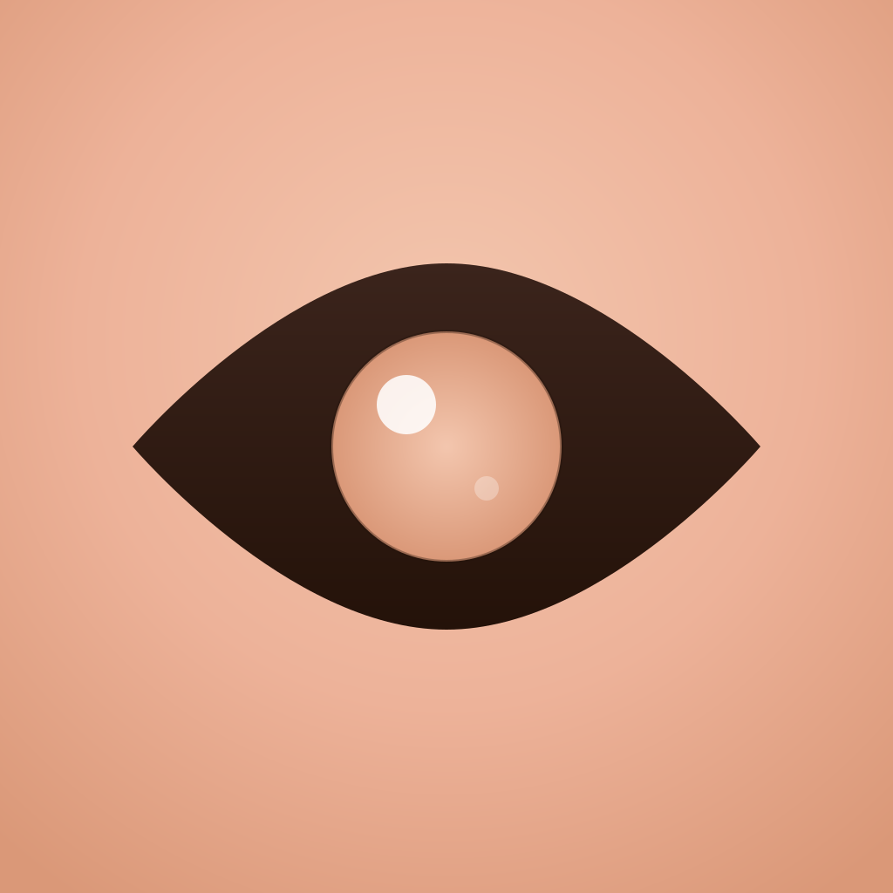
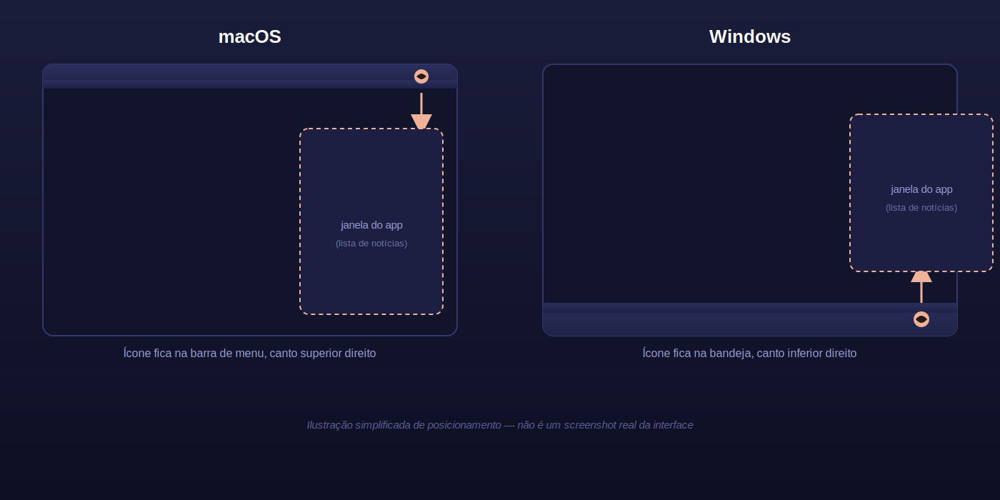

<p align="center">
  
</p>

<h1 align="center">Look News</h1>

<p align="center">
  Agregador de notícias via RSS/Atom/RDF.<br>
  Filtra por relevância com IA e entrega direto na bandeja do sistema.
</p>

<p align="center">
  <a href="https://github.com/clemilsonazevedo/look-news/releases/latest">
    
  </a>
</p>

## Instalação

**macOS / Linux**
```bash
curl -fsSL https://raw.githubusercontent.com/clemilsonazevedo/look-news/main/install.sh | bash
```

**Windows** (PowerShell)
```powershell
irm https://raw.githubusercontent.com/clemilsonazevedo/look-news/main/install.ps1 | iex
```

Pronto. Só abrir o app e ele aparece como ícone na bandeja do sistema.

## Como funciona

Roda em segundo plano. Clique no ícone para ver as notícias mais relevantes das suas fontes.

<p align="center">
  
</p>

## Fontes para começar

| Fonte | Feed |
|-------|------|
| Huncoding | `https://huncoding.com/feed.xml` |
| TabNews | `https://www.tabnews.com.br/recentes/rss` |
| Tecnoblog | `https://tecnoblog.net/feed/` |
| TechCrunch | `https://techcrunch.com/feed/` |
| SecurityWeek | `https://www.securityweek.com/feed/` |

Adicione qualquer feed RSS, Atom ou RDF. Para encontrar novos, busque por “RSS” no site ou peça a uma IA:

> Encontre fontes RSS sobre [seu tema]. Retorne os links diretos dos feeds.

## Estrutura

| Parte | Descrição | Docs |
|-------|-----------|------|
| **Tray** | App Electron (bandeja) | [tray/README.md](tray/README.md) |
| **API** | Backend Go + IA | [api/README.md](api/README.md) |

## Licença

MIT